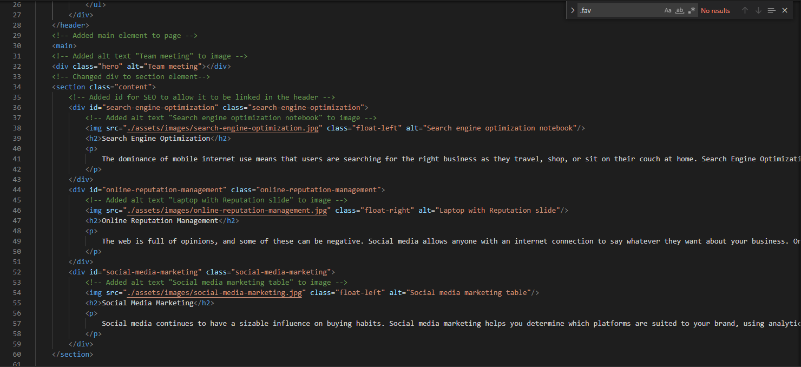

# Code Refactor Starter Code

# Horiseon Website Refactor

 In this website several things had to be refactored to work as intended. First was changing the title to the website's name. Then several elements were updated from div tags to their respective elements. All of the images were updated with alt text. One of the header elements needed to have an id updated to allow it to link to the correct element lower on the page. 

# Example of code refactor 

# Website features 

[Live website link](https://mikemonihan.github.io/Horiseon_Website/)